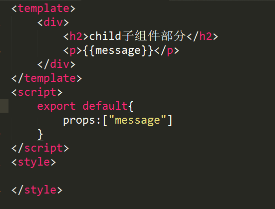
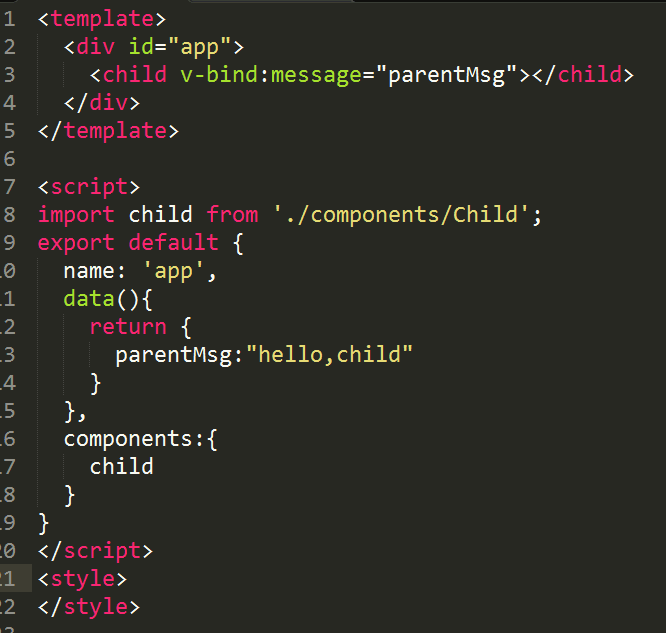
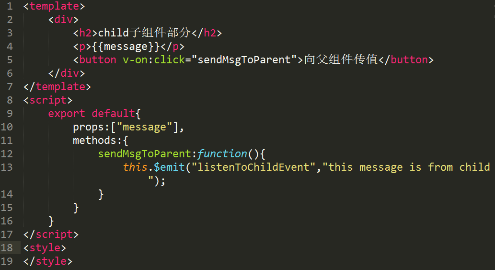
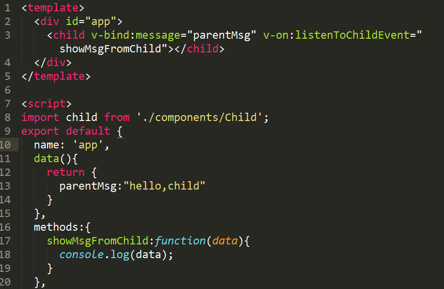

"# vue-" 
## Vue之父组件子组件之间的相互通信

vue的好处之一就是组件化，可以复用模板。组件化的应用也给我们带来了一些问题，就是父组件和子组件之间的数据传递。

在我们的code中父组件app.vue

### 一.父组件向子组件传值（数据）props

1.在子组件创建props，然后创建一个`message`的属性

2.我们在父组件中注册一个子组件`code`中我们命名为"child",用`v-bind`做绑定。

以上工作就完成了父组件向子组件传值

+ 子组件在props中创建一个属性，用于接收父组件传过来的值。
+ 父组件中注册子组件
+ 在子组件标签中添加子组件props中创建的属性
+ 把需要传给子组件的值赋给该属性

### 二.子组件向父组件传值（$emit）

1.在子组件创建一个按钮（或者监听），给按钮绑定一个事件

2.在创建的事件函数中使用`$emit`来触发一个自定义事件，并传递一个参数。

3.在父组件中的子组件标签里面监听自定义事件并添加一个响应该事件的处理方法

以上可以实现子组件向父组件传值

+ 子组件中需要以某种方式如：点击、监听等触发一个自定义事件
+ 将需要传的值作为`$emit`的第二个参数，该值将作为实参传给响应自定义事件的方法
+ 在父组件中注册子组件标签上绑定对自定义事件的的监听

在传值的过程中不管是子组件向父组件传值，还是父组件向自组件传值，他们都需要有一个共同的中间介质。
